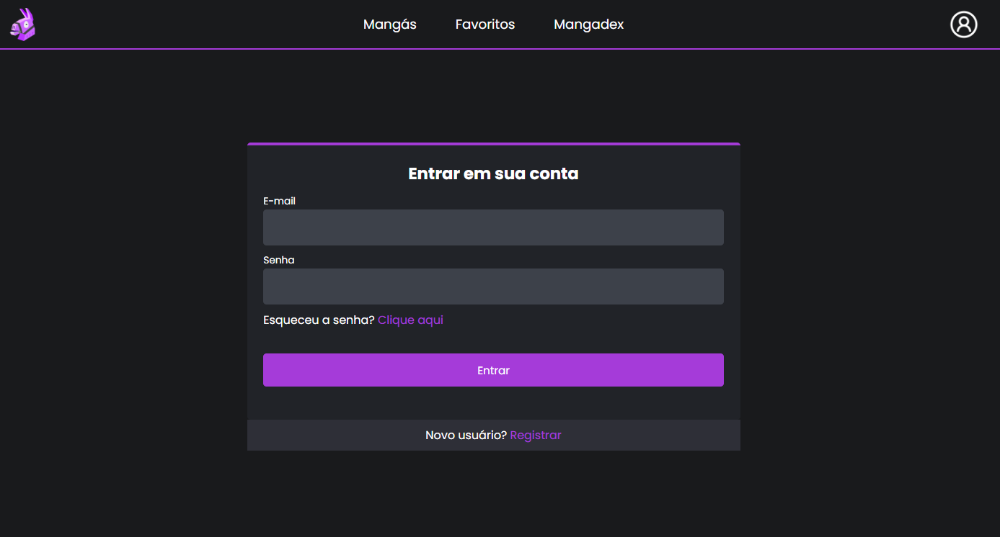
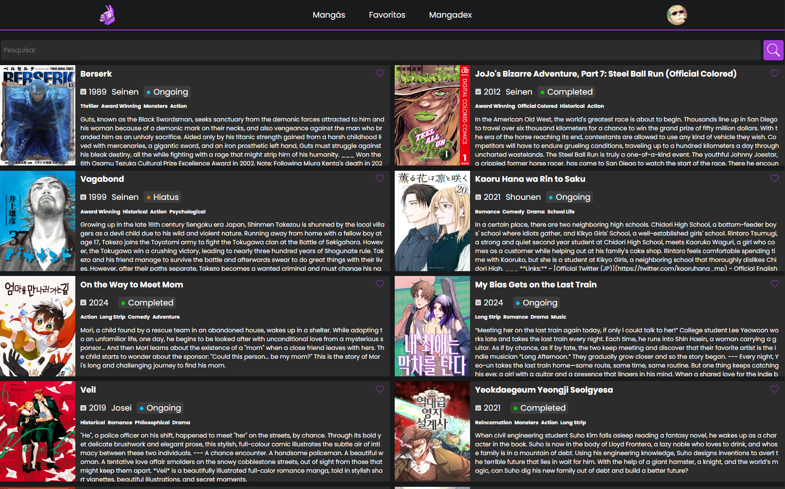

# AnimeList – Aplicação Web Fullstack (React e Node + Express)

Neste projeto foi realizado o desenvolvimento de uma aplicação web fullstack desenvolvida para a disciplina **XDES03 – Programação Web** da Universidade Federal de Itajubá (UNIFEI).

O sistema permite que usuários criem contas, façam login, salvem mangás como favoritos, adicionem comentários e interajam com dados reais obtidos da **API pública da Mangadex**.

#### Tela de Login


#### Tela de Mangás


#### Tela de Favoritos

---

## ⚙️ Funcionalidades Principais

<ul>
  <li>Cadastrar um novo usuário no banco de dados</li>
  <li>Entrar na aplicação utilizando um usuário existente</li>
  <li>Buscar mangás favoritos</li>
  <li>Salvar mangá como favorito</li>
  <li>Remover mangá dos favoritos</li>
  <li>Adicionar comentário sobre um mangá favorito</li>
  <li>Remover comentário sobre um mangá favorito</li>
  <li>Editar comentário sobre um mangá favorito</li>
</ul>

### 🔐 Autenticação & Autorização

-   Cadastro com validações (Yup)
-   Login com validação
-   Senhas criptografadas com **bcrypt**
-   Autenticação com **JWT**
-   Proteção de rotas privadas no backend e frontend

### 📚 CRUD Completo

Recurso escolhido: **Mangás Favoritos + Comentários**

-   Criar
-   Ler
-   Atualizar
-   Deletar

### 🌐 API Externa

Integração com a **Mangadex API** para:

-   Buscar mangás reais
-   Exibir capas
-   Paginar resultados

### 💾 Persistência

-   Armazenamento local em arquivos JSON (sem necessidade de banco de dados)
-   Estrutura backend em:
    -   Services
    -   Controllers
    -   Rotas
    -   Middlewares

### 💻 Frontend (React)

-   Componentização
-   Estados e efeitos
-   Protected Routes
-   Formulários validados com **Yup + React Hook Form**

---

### 🔧 Instruções para rodar a aplicação

1° Clone o repositório a partir de seu terminal:

```bash
  git clone git@github.com:rodrigoruan16/XDES03-AnimeList.git
```

2° Acesse a pasta server e renomeie o arquivo '.dev.env' para '.env', e, se desejado, altere suas configurações.

3º Vá para a pasta raíz e execute para instalar as dependências e rodar tanto o server quanto o client:

```bash
  ./start.sh
```

<h2>🛠️ Bibliotecas / Linguagens</h2>

-   [React](https://pt-br.reactjs.org/) - O React é uma biblioteca JavaScript de código aberto com foco em criar interfaces de usuário em páginas web.
-   [axios](https://axios-http.com/docs/intro) - Axios é um cliente HTTP baseado-em-promessas para o node. js e para o navegador.
-   [react-router](https://reactrouter.com/) - O React Router é uma lib completa para controle de rotas.
-   [Node](https://nodejs.org/en/) - Node.js é um software de código aberto, multiplataforma, baseado no interpretador V8 do Google e que permite a execução de códigos JavaScript fora de um navegador web.
-   [dotenv](https://www.npmjs.com/package/dotenv) - Carrega variáveis de ambiente de um arquivo `.env` em `process.env`
-   [cors](https://www.npmjs.com/package/cors) - CORS - Cross-Origin Resource Sharing (Compartilhamento de recursos com origens diferentes) é um mecanismo que usa cabeçalhos adicionais HTTP para informar a um navegador que permita que um aplicativo Web seja executado em uma origem (domínio) com permissão.
-   [express](https://expressjs.com/pt-br/) - Express.js é um framework para Node.js que fornece recursos mínimos para construção de servidores web.
-   [jsonwebtoken](https://www.npmjs.com/package/jsonwebtoken) - JWT (JSON Web Token) é um método padrão da indústria para realizar autenticação entre duas partes por meio de um token assinado que autentica uma requisição web.
-   [bcrypt](https://www.npmjs.com/package/bcrypt) - bcrypt é um método de criptografia do tipo hash para senhas baseado no Blowfish.
-   [Yup](https://www.npmjs.com/package/yup) - O Yup usa uma linguagem descritiva para criar schemas de validação.

 <h2>Contato</h2>

<a href="https://github.com/rodrigoruan16">GitHub</a> | <a href="https://br.linkedin.com/in/rodrigoruan">Linkedin</a> | <a href="mailto:rodrigopython16@gmail.com">Gmail</a>
